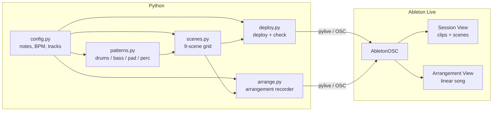

# music-production

Learning techno w/ [pylive](https://github.com/ideoforms/pylive). 

| Command | What it does |
|---------|-------------|
| `uv run python deploy.py` | Push all 9 scenes to Ableton's Session View |
| `uv run python deploy.py --check` | Test the Ableton/OSC connection and print track info |
| `uv run python arrange.py` | Record scenes into Arrangement View with volume automation |
| `uv run ruff check .` | Lint the project |
| `uv run ruff format .` | Format the project |

## Architecture

## File overview

- **`config.py`** — MIDI note constants, BPM, bar length, track indices.
- **`patterns.py`** — Reusable pattern builders (`drums`, `bass`, `pad`, `perc` namespaces). Each method returns a `(clip) -> None` builder.
- **`scenes.py`** — The Session View grid. Composes patterns with specific parameters into 9 scenes. This is the main file to edit when reshaping the track.
- **`deploy.py`** — Connects to Ableton, clears old clips, and writes scenes. Also contains `--check` for connection diagnostics.
- **`arrange.py`** — Fires scenes in sequence while Ableton records, producing a linear arrangement with per-section volume automation.
